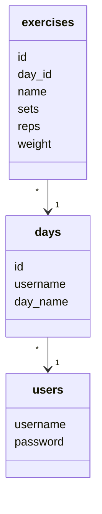
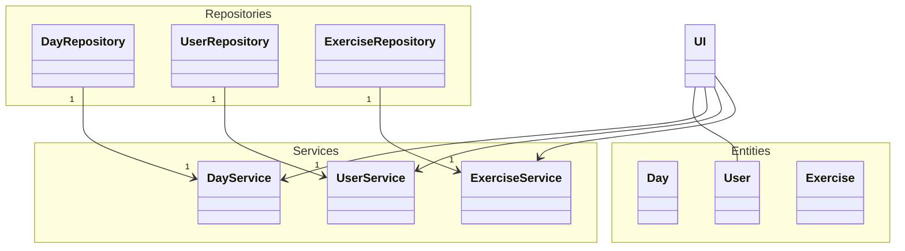

```mermaid
 classDiagram
      exercises "*" --> "1" days
      days "*" --> "1" users
      class users{
          username
          password
      }
      class days{
          id
          username
          day_name
      }
      class exercises{
          id
          day_id
          name
          sets
          reps
          weight
      }
```

```mermaid
classDiagram
    namespace Services {
        class DayService
        class UserService
        class ExerciseService
    }
    namespace Repositories {
        class DayRepository
        class UserRepository
        class ExerciseRepository
    }
    namespace Entities {
        class Day
        class User
        class Exercise
    }

    class UI
    UI -- User
UI --> DayService
UI --> UserService
UI --> ExerciseService
DayRepository "1" --> "1" DayService
UserRepository "1" --> "1" UserService
ExerciseRepository "1" --> "1" ExerciseService
```
