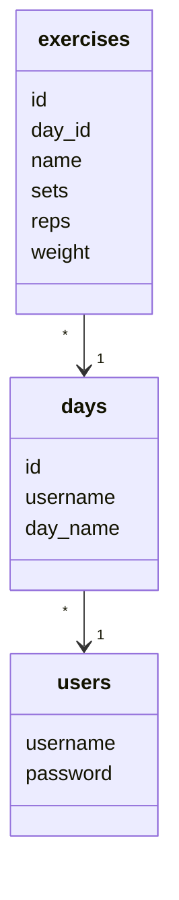
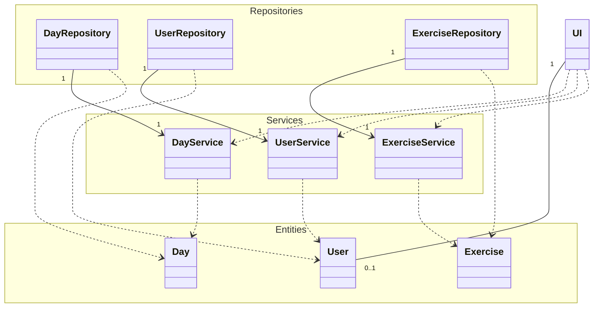
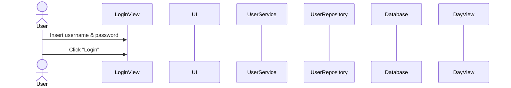

## Sovelluslogiikka

```mermaid
 classDiagram
      exercises "*" --> "1" days
      days "*" --> "1" users
      class users{
          username
          password
      }
      class days{
          id
          username
          day_name
      }
      class exercises{
          id
          day_id
          name
          sets
          reps
          weight
      }
```
## Pakkauskaavio

```mermaid
classDiagram
    namespace Services {
        class DayService
        class UserService
        class ExerciseService
    }
    namespace Repositories {
        class DayRepository
        class UserRepository
        class ExerciseRepository
    }
    namespace Entities {
        class Day
        class User
        class Exercise
    }

    class UI
    UI "1" -- "0..1" User
UI ..> DayService
UI ..> UserService
UI ..> ExerciseService
DayRepository "1" --> "1" DayService
UserRepository "1" --> "1" UserService
ExerciseRepository "1" --> "1" ExerciseService
DayService ..> Day
UserService ..> User
ExerciseService ..> Exercise
DayRepository ..> Day
UserRepository ..> User
ExerciseRepository ..> Exercise

```

## Käyttäjän sisäänkirjautuminen

```mermaid
sequenceDiagram
    actor User
    participant LoginView
    participant UI
    participant UserService
    participant UserRepository
    participant Database
    participant DayView

    User->>LoginView: Insert username & password
    User->>LoginView: Click "Login"

```
