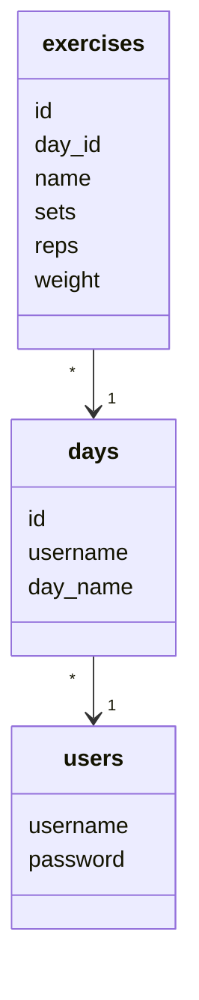
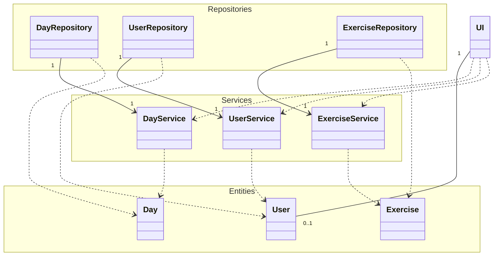
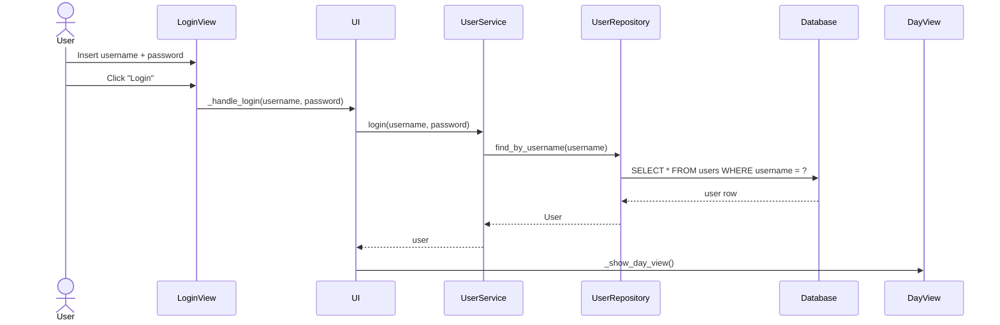

## Rakenne

Sovelluksen rakenne on kolmikerroksinen. ui-kansion sisältö vastaa sovelluksen käyttöliittymästä, Services sovelluslogiikasta, ja Repositories toimintojen tallentamisesta tietokantaan. Repositories- ja Services-kansioiden sisältö hyödyntää Entities-kansion sisältöä.

## Käyttöliittymä

Käyttöliittymä sisältää neljä erilaista näkymää:
- Kirjautuminen
- Uuden käyttäjän luominen
- Luodut päivät
- Valitun päivän sisältämät harjoitteet

Jokaisella näkymällä on oma luokka, joka vastaa sen esillepanosta. Kirjautumisen jälkeen avautuva päivänäkymä näyttää käyttäjän luomat päivät. Haluttua päivää klikkaamalla avautuu näkymä, joka näytää päivän sisältämät harjoitteet. Tämä näkymä hyödyntää ExerciseElement-luokkaa, joka vastaa luodun harjoitteen esittämisestä mielekäällä tavalla, ja joka sisältää tiedot harjoitteen nimestä, sarjoista, toistoista ja käytettävästä painosta.

Käyttäjä voi luoda uusia päiviä päivänäkymässä. Valitun päivän näkymässä, joka näyttää päivän sisältämät harjoitteet, käyttäjä voi luoda uusia harjoitteita, poistaa ja päivittää niiden arvoja.

Käyttöliittymä on eriytetty sovelluslogiikasta ja toteuttaa toiminnallisuuksia kutsumalla eri Services-kansion sisältämiä metodeja.

## Sovelluslogiikka

Sovelluksen tietokantarakenne on kolmikerroksinen. users-taulu sisältää tiedot käyttäjän nimimerkistä ja salasanasta. Kun uusi päivä luodaan, days-tauluun tallennetaan tieto siitä, mille käyttäjätunnukselle päivä kuuluu (username). Uusia harjoitteita luodessa tallennetaan tieto siitä, mille päivälle harjoite kuuluu (day_id). Jos käyttäjä poistaa tietyn päivän, päivän lisäksi myös sen sisältämät harjoitteet poistetaan automaattisesti tietokannasta.

## Pakkauskaavio

## Käyttäjän sisäänkirjautuminen

